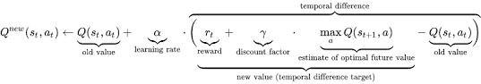
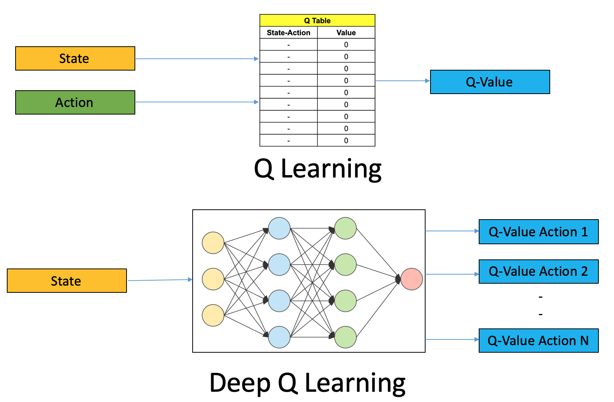

# QLearning

### RL Agent-Environment:
- The main task of a Reinforcement learning task is to train an agent which interacts with its environment.
- The agent arrives at different scenarios known as states by performing actions.
- Actions leads to rewards (+ve or -ve)

The algorithm works in such a way that it tires to maximize the reward for the agent across an episode. (an episode is a single playback from the first state till the last state)

## Markov Decision Process:
**What is MDP:**\
Any random process in which the probability of being in a given state depends only on the previous state and the transition from that state is a Markov process.

**A MDP model contains:**
- A set of possible states S.
- A set of possible actions A.
- A real valued reward function R(S,A).
- A description T of each action's effects in each state.

## What exactly is QLearning:
It basically implies we create a cheat-sheet on what is the best action in each possible state based on reward.

We will create a q-table which will be updated after it performs a sequence of actions that will eventually generate the maximum total reward. This total value is also called the Q-value and it is given by the following equation.

.
.

- In the above alpha is the learning rate or step size. This simply determines to what extent newly acquired information overrides old information.

- In the temporal difference equation defines the Q value from being at state s and performing action a is the immediate reward r(s,a) plus the highest Q-value possible from the next state s’. Gamma here is the discount factor which controls the contribution of rewards further in the future.

- Adjusting the value of gamma (discount factor) will diminish or increase the contribution of future rewards.

---
## Now what is Deep QLearning:

QLearning's working principle is simple, but ont of its biggest drawbacks is that the cheatsheet can become too long. multiple actions + millions of states makes it impossible to store all the data and also makes it so that it takes a very long time to explore the table.

So, instead with the great power of Deep Learning we try to approximate these Q values.

The state is given as input and the NN generates the Q values for all the possible actions as output.

The difference is illustrated below

